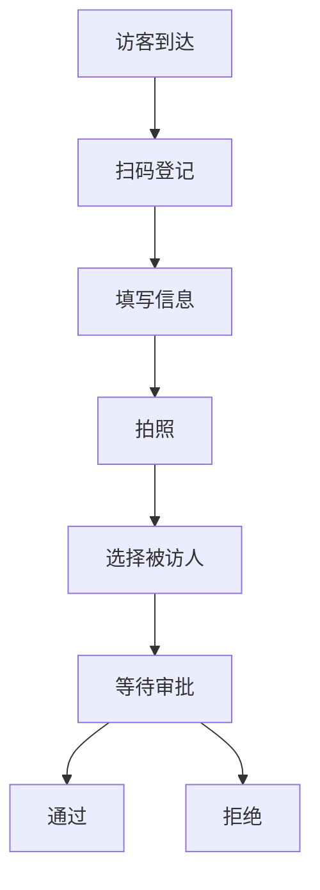
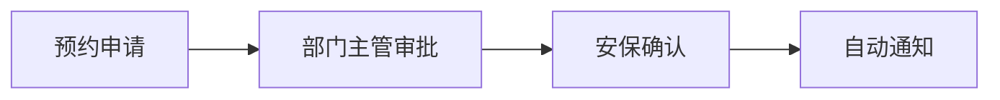

 # 访客系统产品需求文档(PRD)

## 文档信息

- 文档版本: V1.0
- 作者: PM
- 创建日期: 2024-01-01

## 1. 产品概述

### 1.1 产品背景
用于管理企业访客登记、预约、审批等流程的系统，提升企业访客管理效率和安全性。

### 1.2 产品目标
- 规范访客登记流程
- 提高访客管理效率
- 增强企业安全管理
- 改善访客体验

## 2. 功能需求

### 2.1 访客登记模块


#### 2.1.1 基本信息登记
- 姓名
- 手机号
- 身份证号
- 来访目的
- 访客照片
- 被访人信息

#### 2.1.2 健康信息
- 体温检测
- 健康码状态

### 2.2 预约管理模块
- 访客预约申请
- 预约审批流程
- 预约日程管理
- 预约提醒

### 2.3 审批流程


### 2.4 访客管理
- 访客记录查询
- 黑名单管理
- 访客统计分析
- 异常警报

## 3. 非功能需求

### 3.1 性能需求
- 系统响应时间 < 2秒
- 并发用户数 > 100
- 系统可用性 > 99.9%

### 3.2 安全需求
- 数据加密存储
- 访问权限控制
- 操作日志记录

### 3.3 兼容性要求
- 支持主流浏览器
- 支持移动端访问

## 4. 界面原型

### 4.1 访客登记页面
```
+----------------------+
|    访客登记系统      |
+----------------------+
|   姓名: [         ]  |
|   手机: [         ]  |
|   证件: [         ]  |
|   目的: [         ]  |
|   照片: [拍照]      |
|                      |
|   [提交] [取消]      |
+----------------------+
```

### 4.2 审批界面
```
+----------------------+
|    访客审批         |
+----------------------+
| □ 访客A  待审批     |
| □ 访客B  已通过     |
| □ 访客C  已拒绝     |
|                      |
| [批量审批] [详情]    |
+----------------------+
```

## 5. 项目时间规划

### 5.1 开发周期
- 需求分析: 1周
- 设计开发: 4周
- 测试: 2周
- 部署上线: 1周

### 5.2 里程碑
1. 需求确认完成
2. 原型设计完成
3. 开发完成
4. 测试通过
5. 正式上线

## 6. 风险评估

### 6.1 潜在风险
- 系统安全风险
- 数据隐私泄露
- 系统稳定性

### 6.2 应对措施
- 加强安全测试
- 完善数据保护机制
- 建立应急预案