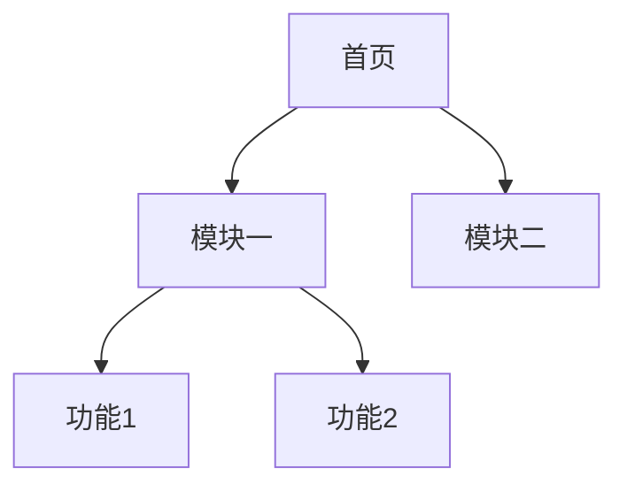

 # 产品需求文档(PRD)

## 1. 文档信息
- 文档名称：Test功能需求说明书
- 版本号：V1.0
- 创建时间：2024-01-01

## 2. 修订历史
| 版本号 | 修订时间 | 修订说明 | 修订人 |
|--------|----------|----------|--------|
| V1.0   | 2024-01-01 | 初始版本 | PM |

## 3. 需求背景
[此处描述产品需求的背景和目标]

## 4. 功能需求
### 4.1 功能概述
[此处描述主要功能点]

### 4.2 详细功能
#### 4.2.1 功能模块一
```
[功能模块一的详细描述]
```

## 5. 原型设计


## 6. 非功能需求
### 6.1 性能需求
- 响应时间
- 并发量

### 6.2 安全需求
- 数据安全
- 访问控制

## 7. 验收标准
- [ ] 测试项1
- [ ] 测试项2

## 8. 附录
### 8.1 术语表
| 术语 | 说明 |
|------|------|
| 示例 | 示例说明 |