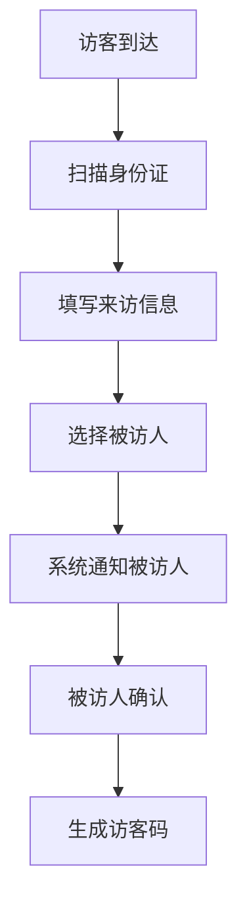

 # 访客系统产品需求文档 (PRD)

## 1. 文档信息

- 文档版本：V1.0
- 作者：PM
- 创建日期：2024-01-01

## 2. 产品概述

### 2.1 产品背景
为了加强单位安全管理，提高访客登记效率，实现访客信息的数字化管理，开发此访客系统。

### 2.2 产品目标
- 规范访客登记流程
- 提高访客登记效率
- 实现访客数据可追溯
- 增强单位安全管理

## 3. 功能需求

### 3.1 访客登记


#### 3.1.1 基本信息采集
- 身份证信息自动识别
- 访客照片采集
- 来访目的选择
- 被访人选择

#### 3.1.2 访客通行码
- 生成唯一二维码
- 有效期设置
- 可多次使用（限定时间内）

### 3.2 访客管理

#### 3.2.1 访客记录查询
- 按时间查询
- 按访客信息查询
- 按被访人查询

#### 3.2.2 数据统计
- 访客流量统计
- 来访目的分析
- 高频访客统计

### 3.3 系统管理

#### 3.3.1 权限管理
- 管理员权限
- 前台接待权限
- 部门管理权限

#### 3.3.2 系统配置
- 访客规则配置
- 黑名单管理
- 系统参数设置

## 4. 非功能需求

### 4.1 性能需求
- 系统响应时间：<2秒
- 并发访问量：>100人/分钟
- 系统稳定性：99.9%

### 4.2 安全需求
- 数据加密传输
- 访客信息脱敏处理
- 操作日志记录

## 5. 界面原型

### 5.1 访客登记界面
```
+----------------------+
|    访客登记系统     |
+----------------------+
| [ 身份证识别区域 ]  |
|                      |
| 姓名：[          ]  |
| 电话：[          ]  |
| 来访目的：[下拉选择]|
| 被访人：[搜索选择 ] |
|                      |
| [确认登记] [取消]   |
+----------------------+
```

### 5.2 访客记录查询界面
```
+------------------------+
|      访客记录查询     |
+------------------------+
| 日期：[日期选择    ]  |
| 关键词：[         ]   |
|                        |
| [查询记录列表]        |
| ----------------       |
| 访客信息  时间  状态  |
| ....                  |
+------------------------+
```

## 6. 项目计划

### 6.1 开发周期
- 需求分析：1周
- 设计开发：3周
- 测试部署：1周
- 总周期：5周

### 6.2 迭代计划
1. 第一迭代：基础访客登记功能
2. 第二迭代：访客管理功能
3. 第三迭代：系统管理功能

## 7. 风险评估

### 7.1 主要风险
- 身份证识别准确率
- 系统并发承载能力
- 数据安全保护

### 7.2 应对措施
- 选用高精度身份证识别设备
- 服务器性能优化
- 数据加密和权限控制

## 8. 附录

### 8.1 术语说明
- 访客码：访客通行的电子凭证
- 黑名单：禁止进入的访客名单

### 8.2 参考文档
- 《单位安全管理规定》
- 《访客系统技术规范》