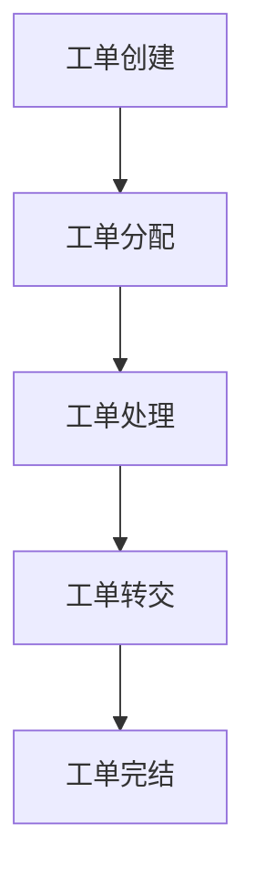

 # 咨询工单转交系统产品需求文档

## 1. 文档信息

- 文档状态：初稿
- 版本号：V1.0
- 作者：PM
- 最后更新日期：2024-01-01

## 2. 产品概述

### 2.1 产品背景
为提高客服工作效率，实现工单的合理分配和转交，需要开发一个专业的工单转交系统。

### 2.2 产品目标
- 提升工单处理效率
- 优化工单分配流程
- 提高客户满意度
- 实现工单全流程追踪

## 3. 功能需求

### 3.1 工单管理


#### 3.1.1 工单创建
- 支持手动创建工单
- 支持自动导入工单
- 必填信息：客户信息、问题描述、优先级

#### 3.1.2 工单分配
- 支持自动分配
- 支持手动指派
- 支持按技能组分配
- 支持按工作量分配

#### 3.1.3 工单转交
- 支持跨部门转交
- 支持添加转交原因
- 支持转交通知
- 记录转交历史

### 3.2 用户角色
- 系统管理员
- 客服主管
- 客服专员
- 技术支持

### 3.3 数据统计
- 工单处理时长统计
- 转交频率统计
- 处理效率分析
- 客户满意度统计

## 4. 非功能需求

### 4.1 性能需求
- 系统响应时间：<2秒
- 并发用户数：>100
- 系统可用性：99.9%

### 4.2 安全需求
- 用户认证和授权
- 数据加密传输
- 操作日志记录
- 数据备份机制

## 5. 界面原型

### 5.1 工单列表
```
+------------------+
|  工单列表        |
+------------------+
| ID | 标题 | 状态 |
|----+------+------|
| 01 | xxx  | 处理中|
| 02 | xxx  | 待转交|
+------------------+
```

### 5.2 转交界面
```
+-------------------------+
|     工单转交           |
+-------------------------+
| 选择接收部门: [下拉框] |
| 转交原因: [文本框]     |
| 优先级: [选择框]       |
|                        |
| [确认] [取消]          |
+-------------------------+
```

## 6. 项目规划

### 6.1 开发周期
- 需求分析：1周
- 设计开发：4周
- 测试部署：2周
- 总周期：7周

### 6.2 验收标准
- 所有核心功能测试通过
- 性能指标达标
- 安全测试通过
- 用户培训完成

## 7. 风险评估
- 系统集成风险
- 数据迁移风险
- 用户接受度风险
- 性能风险

## 8. 附录
- 术语表
- 相关文档引用
- 修订历史